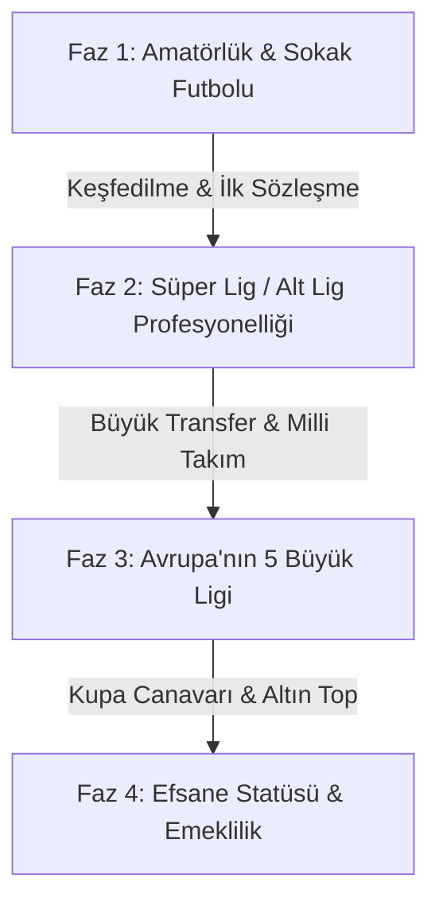
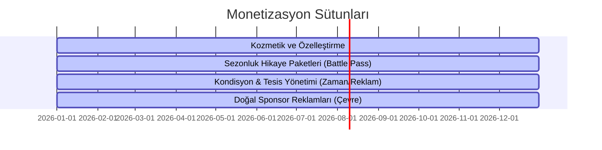

# OYUN TASARIM BELGESİ (GDD)
## Proje Adı Önerisi: *Futbol Atlası: Efsane Yolculuğu* (Football Atlas: Legend's Journey)
**Tür:** 2D / İzometrik, RPG Elementli Oyuncu Kariyeri Futbol Oyunu  
**Platform:** iOS ve Android (Mobil Öncelikli)  
**Hedef Kitle:** Futbol severler, menajerlik/kariyer oyunu tutkunları, hızlı ama derin oynanış arayan mobil oyuncular.  
**Grafik Tarzı:** World Soccer Champs benzeri basitleştirilmiş, canlı renklere sahip, akıcı animasyonlu ve "low-poly" / "chibi" tarzı sevimli karakter tasarımları.

---

## 1. Hikaye Akışı (Story Mode)

Oyun, sadece yeşil sahada değil, saha dışındaki dramalarla da şekillenen bir **RPG/Hikaye Deneyimi** sunar. Oyuncu, saha içi performansı kadar saha dışı kararlarıyla da kariyerini yönlendirir.

### Kariyer Aşamaları (Fazlar)


#### Faz 1: Toprak Sahadan Çıkış (Amatör Dönem)
*   **Başlangıç:** Oyuncu, amatör bir mahalle kulübünde (veya halı sahada/sokakta) başlar. Tesisler dökülmekte, kramponlar yırtıktır.
*   **Mentor Karakter: "Dayı" (Eski Futbolcu):** Kulübün malzemecisi ya da mahallenin eski topçusu olan huysuz ama bilge bir mentor karakter. Bize saha içi taktikleri ve hayat dersleri verir.
*   **Dönüm Noktası:** Bölgesel Amatör Lig (BAL) final maçında, tribündeki gözlemcilerin (scout) dikkatini çekmek için son 15 dakikada oyuna gireriz. Maçtaki performansımıza göre Süper Lig veya 1. Lig takımlarından teklifler gelir.

#### Faz 2: Süper Lig'e Merhaba (Profesyonelliğe Geçiş)
*   **Kadro Savaşı:** Takıma "Genç Yetenek" olarak katılırız. İlk başlarda yedek kulübesindeyizdir. Teknik direktörün güvenini kazanmak için antrenmanlarda çalışmalı ve oyuna girdiğimiz kısıtlı sürelerde skor üretmeliyiz.
*   **Medya ve Taraftar Baskısı:** İlk derbi maçı öncesi sosyal medyada taraftarlar ikiye bölünür. Yerel spor basınında hakkımızda çıkan "Balon mu, Yıldız mı?" haberleri oyuncunun moralini (Morale) etkiler.
*   **Derbi Atmosferi:** Derbi maçlarında stadyumdaki gürültü ve baskı büyüktür. Bu maçlarda hata yapmak (örn. penaltı kaçırmak) taraftar sevgisini sıfırlayabilir; gol atmak ise oyuncuyu kahraman yapar.

#### Faz 3: Devler Sahnesi (Avrupa'nın 5 Büyük Ligi)
*   Süper Lig'de rüştümüzü ispatladıktan sonra menajerimiz önümüze teklifler getirir.
*   **5 Büyük Lig Kültürü:**
    *   *Premier Lig:* Fiziksel gücün ve hızın tavan yaptığı, yağmurlu sert maçlar.
    *   *La Liga:* Teknik, paslaşma ve estetiğin ön planda olduğu, yaratıcılık gerektiren lig.
    *   *Serie A:* Savunma taktiklerinin boğucu olduğu, gol atmanın en zor olduğu taktiksel lig.
    *   *Bundesliga:* Yüksek pres ve disiplinli takım oyununun hakim olduğu tempolu lig.
    *   *Ligue 1:* Atletizm ve hızlı kontra atakların ön plana çıktığı genç ligi.

---

### RPG & Dramatik Karar Mekanizmaları

Oyun boyunca karşımıza çıkan **Rastgele Hikaye Kartları (Story Events)** ve seçimler, karakterimizin kaderini belirler:

| Olay Tipi | Senaryo | Seçenek A (Profesyonel) | Seçenek B (Riskli/Dramatik) |
| :--- | :--- | :--- | :--- |
| **Sakatlık Krizi** | Kritik Şampiyonlar Ligi maçı öncesi kasığında hafif yırtık tespit edildi. | **Dinlen ve Tedavi Ol:** Maçı kaçır (Kondisyon koruma, Hoca güveni artar, Taraftar hayal kırıklığı). | **İğneyle Oyna:** Maça çık ama sakatlığın kronikleşme riski var (Kısa vadeli popülarite, sakatlık ihtimali %50). |
| **Menajer Seçimi** | Çocukluk arkadaşın menajerliğini yapmak istiyor ama büyük bir menajerlik şirketi seni istiyor. | **Büyük Şirketle Anlaş:** Daha yüksek maaşlı transferler ama arkadaşınla aran bozulur (Moral düşer, Finans artar). | **Arkadaşına Sadık Kal:** Daha az transfer seçeneği ama yüksek sadakat ve moral (Moral artar, Transfer limitlenir). |
| **Gece Hayatı** | Derbi öncesi cuma gecesi lüks bir partiye davet edildin. Magazin muhabirleri kapıda. | **Evde Kalıp Uyu:** Derbiye %100 odaklan (Kondisyon +20, Popülarite stabil). | **Partiye Git:** Eğlen ama kameralara yakalanma riski var (Sosyal Medya Takipçisi +10k, Kondisyon -30, Hoca Disiplin Cezası). |
| **Basın Toplantısı** | Takım arkadaşın maçta sana pas atmadı ve yenildiniz. Gazeteci bunu soruyor. | **"Takım sporudur, normal."** (Takım Uyumu +15, Medya Popülaritesi nötr). | **"Bencilce oynadı, hocanın görmesi lazım."** (Takım Uyumu -30, Bireysel Ego +20, Medya Manşeti). |

---

## 2. Temel Oynanış (Core Gameplay)

Maç oynanışı, mobilde sıkılmadan hızlıca oynanabilecek, **World Soccer Champs** tarzı "Aksiyon-Highlight" (Önemli Anlar) formülüne dayanır.

### Maç Döngüsü (Match Flow)
1.  **Simülasyon Modu:** Maç hızlı bir metin tabanlı veya 2D harita üstünde simüle edilir.
2.  **Highlight Geçişi:** Takımımız atağa kalktığında, frikik kazandığında veya kalemizde tehlike belirdiğinde oyun duraklar ve kontrol oyuncuya geçer.
3.  **Aksiyon Sekansı:** Oyuncu 5-10 saniye içinde pas, orta veya şut kararı vererek pozisyonu tamamlar.

```
[Maç Başlar (Simülasyon)] 
       │
       ▼
[Kritik Atak Pozisyonu Tetiklenir] ────► [Zaman Yavaşlar (Bullet Time)]
                                                   │
                                                   ▼
                                        [Oyuncu Aksiyonu Seçer]
                                        - Pas / Orta (Çizgi Çekerek)
                                        - Şut (Kaleye Swipe/Dokunarak)
                                                   │
                                                   ▼
                                        [Pozisyon Sonuçlanır (Gol/Kaçtı)]
                                                   │
                                                   ▼
                                        [Simülasyona Geri Dönüş]
```

### Kontrol Şeması: Hibrit Karakter Kontrolü
Oyuncuyu tüm takımı yönetmenin yoruculuğundan kurtarmak ve "Kariyer" hissini pekiştirmek için **Hibrit Kontrol** kullanılır:
*   **Topsuz Alanda Pozisyon Alma (Otomatik & Yarı Manuel):** Karakterimiz sahada kendi pozisyonuna göre otomatik koşar. Ekranın solundaki sanal joystick ile koşu yönünü hafifçe etkileyebilir veya topsuz alanda boşluğa kaçıp **"Pas İste"** butonuna basabiliriz.
*   **Top Karakterimize Geldiğinde:** Zaman hafifçe yavaşlar (*Bullet Time*). Bu esnada:
    *   **Pas/Orta:** Parmağımızı arkadaşımıza doğru sürükleyerek (drag & drop) pas atarız.
    *   **Şut:** Parmağımızla kaleye doğru hızlıca kaydırma (swipe) hareketi yaparız. Kaydırma hızı şutun gücünü, kavisi ise falsosunu belirler.
    *   **Çalım:** Karakterin üzerine dokunup gitmek istediğimiz yöne hafifçe dokunarak yetenek puanımıza göre çalım atarız.

### Özel Yetenek Kartları (Active Perks)
Maç sırasında dolan bir "Enerji Barı" sayesinde karakterimizin stiline uygun özel yetenekleri tetikleyebiliriz:
*   **"Roket Şut" (Power Shot):** Kalecinin kurtarma şansını %30 düşüren çok sert bir şut.
*   **"Sihirli Pas" (No-Look Pass):** Savunma oyuncularının araya girme ihtimalini yok eden akıl dolu pas.
*   **"Esneklik" (Dribble Master):** Karşı karşıya pozisyonda rakip stoperi otomatik geçen çalım.

---

## 3. Kariyer ve Gelişim (Career & Progression)

Saha içi başarı, saha dışındaki gelişimle beslenir. Karakterimizin 3 temel sütunu vardır: **Yetenekler (Attributes)**, **Yaşam Tarzı (Lifestyle)** ve **İlişkiler (Relationships)**.

### Antrenman ve Gelişim Sistemi
Oyuncu her hafta sınırlı antrenman puanına (Kondisyon elverdiği sürece) sahiptir. Haftalık program yapılır:
*   **Fiziksel Antrenman:** Güç, Hız, Dayanıklılık (Sakatlık riskini azaltır ama kondisyonu çok tüketir).
*   **Teknik Antrenman:** Şut Gücü, Falso, Kısa Pas, Top Kontrolü.
*   **Zihinsel Antrenman:** Karar Verme, Soğukkanlılık (Önemli anlarda Bullet Time süresini uzatır).

> [!WARNING]
> **Aşırı Antrenman (Over-training):** Haftalık kondisyon %20'nin altına düşerse antrenman yapmak sakatlık riskini %80 artırır. Dinlenme günleri planlanmalıdır.

---

### Sponsorluklar ve Marka Yönetimi
Kariyer basamaklarını tırmandıkça küresel markalar kapımızı çalar:
1.  **Krampon Sponsoru (Nike/Adidas Muadili):** Şut ve Hız yeteneklerine kalıcı +2 bonus verir. Sözleşme şartı: *"Derbide gol at veya sezonu 15 golün üstünde bitir."*
2.  **Enerji İçeceği Sponsoru:** Maç içi kondisyon yenilenmesini hızlandırır. Sözleşme şartı: *"Sosyal medyada haftada 1 kez paylaşım yap."*
3.  **Saat & Moda Sponsoru:** Maç başına kazanılan parayı ve Popülariteyi artırır.

---

### Yaşam Tarzı (Lifestyle) ve Satın Alımlar
Kazanılan haftalık maaşlar sadece banka hesabında birikmez, doğrudan oynanışa etki eden "Yaşam Ögeleri" satın almak için kullanılır:

| Satın Alınabilir Öge | Fiyatı (Haftalık Maaş Cinsinden) | Oynanışa / Karaktere Etkisi |
| :--- | :--- | :--- |
| **Özel Şef (Nutritionist)** | Orta (Haftalık ödeme) | Maç sonrası Kondisyon yenilenmesini %+15 artırır. |
| **Kişisel Spor Fizyoterapisti** | Yüksek (Haftalık ödeme) | Sakatlanma ihtimalini %25 düşürür, iyileşme süresini yarıya indirir. |
| **Lüks Spor Araba** | Çok Yüksek (Tek Seferlik) | Sosyal Medya Popülaritesini +50k artırır. Ancak teknik direktörün gözündeki "Disiplin" puanını -10 düşürür. |
| **Sosyal Medya Danışmanı (PR Agent)** | Orta (Haftalık ödeme) | Sponsorlardan gelen gelirleri %20 artırır. |
| **Penthouse Daire / Malikane** | Ultra Yüksek (Tek Seferlik) | Moral seviyesini maksimuma kilitler, takım içi uyumu artırmak için takım arkadaşlarına ev partisi verme seçeneği açar. |

---

## 4. Monetizasyon (Para Kazanma Stratejisi)

Oyunu "Pay-to-Win" (P2W) yapmadan, oyuncuların kendilerini baskı altında hissetmeyeceği, ancak keyifle harcama yapacağı adil ve sürdürülebilir bir gelir modeli tasarlanmıştır.



### 1. Kozmetik Satışlar ve Özelleştirme (Premium Dükkan)
*   **Karakter Görünümü:** Sıra dışı saç stilleri, sakal tasarımları, dövmeler, retro veya fütüristik kramponlar.
*   **Gol Sevinçleri:** Efsanevi futbolcuların ikonik gol sevinçleri (örneğin Cristiano Ronaldo'nun "Siuuu" hareketi, Messi'nin gökyüzünü göstermesi vb.) oyun içi premium para birimiyle satılır.
*   **Ev/Yaşam Alanı Özelleştirme:** Satın alınan malikanenin iç tasarımı için mobilyalar, kupa sergileme odası dekorasyonları.

### 2. "Sezon Kartı" (Season Pass / Career Pass)
*   Her ay yenilenen bir ödül yolu. Oyuncular maç oynadıkça ve gol attıkça XP kazanır.
*   **Ücretsiz Yol:** Standart oyun içi para, temel kondisyon içecekleri.
*   **Premium Yol (Ücretli):** Efsanevi kramponlar, özel hikaye kartlarına erişim (örn. *"Zlatan Ibrahimovic tarzı kibirli diyaloglar açılır"*), özel antrenörler ve benzersiz gol sevinçleri.

### 3. Zaman Kazanımı ve Kolaylık (Hafif Monetizasyon)
*   **Kondisyon İçecekleri (Energy Drinks):** Yoğun maç trafiğinde kondisyonu hemen doldurmak isteyenler için opsiyonel satın alım veya ödüllü reklam (Rewarded Ad) izleme seçeneği.
*   **Sözleşme Yenileme / İkna:** Büyük bir kulübe transfer olurken menajerin pazarlık gücünü artırmak için küçük harcamalar yapılabilir. Ancak bu durum oyun içi normal parayla da dengelenebilir.

### 4. Entegre Edilmiş Doğal Reklamlar (Native Ads)
*   Stadyumdaki reklam panoları, reklam ağları aracılığıyla gerçek markaların afişlerini gösterir. Bu, oyunun gerçekçiliğini (atmosferini) artırırken geliştiriciye pasif gelir sağlar.
*   Hiçbir şekilde zorunlu geçiş reklamı (Pop-up Interstitial Ad) kullanılmaz. Oyuncunun maçı yarıda kesilmez. Sadece maçı bitirdikten sonra isteğe bağlı "Geliri İkiyle Çarp" reklamları sunulur.

### 5. Premium Yan Hikayeler (DLC / Story Packs)
*   Ana oyunu oynamak tamamen ücretsizdir. Ancak oyuncular dilerse çok küçük bir ücret karşılığında özel "Alternatif Tarih" kariyer paketleri satın alabilirler:
    *   **"90'lar Nostaljisi" Paketi:** Oyunu 90'ların efsane kadroları ve nostaljik saç tarzlarıyla oynamak.
    *   **"Kaleci Kariyeri" Paketi:** Oyunu tamamen kaleci mekanikleriyle oynamayı sağlayan özel bir mod.

---

## Özet: Neden Başarılı Olur ve Bağımlılık Yapar?

1.  **Düşük Giriş Bariyeri, Derin Deneyim:** Maçlar hızlıdır (2-3 dakika), mobil cihazlarda otobüste, metroda kolayca oynanabilir. Ancak arka plandaki transfer piyasası, evlilik/yaşam kararları ve menajerlik ilişkileri oyunu derinleştirir.
2.  **Duygusal Bağ Kurma:** Kendi yarattığı karakterin sakatlanıp yıkıldığını, taraftarlarca yuhalandığını gören oyuncu, karakterle duygusal bağ kurar ve onu zirveye taşımak için hırslanır.
3.  **Adil Ticaret:** Oyuncu para harcamadan da dünya kupasını kaldırabilir; para harcamak sadece süreci hızlandırır veya görsel/hikayesel çeşitlilik katar.
