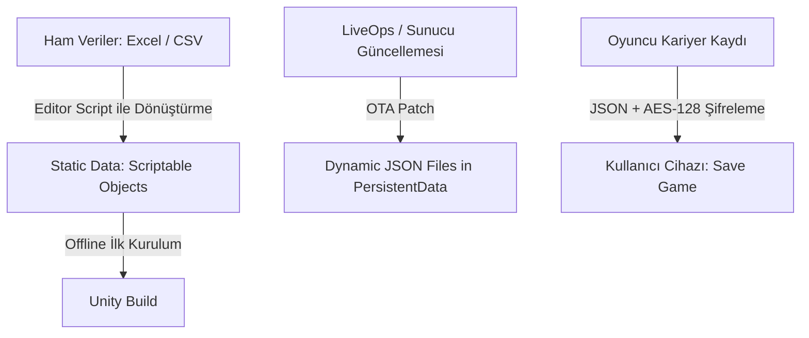

# TEKNİK MİMARİ REHBERİ
## Proje Adı: *Futbol Atlası* | Unity Mobil (C#) Altyapı Mimari Tasarımı

Bu rehber; **Süper Lig + 5 Büyük Lig** ölçeğinde (~120 takım, ~3000 oyuncu) veri tabanı optimizasyonunu, simülasyondan 2D/2.5D aksiyona geçiş yapan bir maç motorunu ve pürüzsüz mobil kontrolleri Unity (C#) üzerinde nasıl inşa edeceğinizi açıklar.

---

## 1. Veri Tabanı ve Proje Mimarisi (Database & State Management)

Mobil oyunlarda bellek kullanımı, CPU döngüleri ve batarya tüketimi kritik öneme sahiptir. Kararlı verileri (Static Data) ve değişken verileri (Dynamic Save State) birbirinden ayırmalıyız.

### Veri Depolama Stratejisi


#### A. Statik Veriler (Takımlar, Oyuncular, Fikstür Şablonları)
*   **Öneri:** **Scriptable Objects (SO) + JSON Hibrit Altyapısı**
*   *Neden Scriptable Objects?* Unity'nin kendi bellek yönetimini kullanır. Bir oyuncunun verisine (örneğin isim, doğum tarihi, sabit yetenekler) ihtiyaç duyulduğunda sadece referans yüklenir, her seferinde bellek kopyası oluşturulmaz. Unity Inspector ile görsel olarak düzenlenebilirler.
*   *JSON Entegrasyonu:* LiveOps güncellemeleri veya transfer yamaları için oyunu mağazada güncellemeden, sunucudan bir JSON dosyası indirip `Application.persistentDataPath` altına kaydedebiliriz. Çalışma zamanında (runtime) JSON verileri SO şablonlarının üzerine yazılır.

##### Kod Yapısı Örneği (PlayerSO.cs):
```csharp
using UnityEngine;

[CreateAssetMenu(fileName = "NewPlayer", menuName = "Database/Player")]
public class PlayerSO : ScriptableObject
{
    public string playerId;
    public string playerName;
    public int age;
    public string nationality;
    
    [Header("Base Stats")]
    public int speed;
    public int shooting;
    public int passing;
    public int defending;
    public int stamina;
}
```

#### B. Dinamik Veriler (Save Game & Oyuncu Gelişimi)
*   **Öneri:** **Binary/JSON Flat File (Persistent Data Path)**
*   *SQLite Neden Gerekli Değil?* SQLite mobil platformlarda ek kütüphane boyutu (overhead) getirir ve basit sorgular için gereksiz kaynak tüketir. ~3000 oyuncunun sezonluk istatistikleri (gol sayısı, asisti, yorgunluğu) JSON formatında serileştirildiğinde bellek boyutu **~1-2 MB**'ı geçmez.
*   **Yöntem:** Oyuncu oyunu kaydettiğinde, tüm kariyer durumunu tutan tek bir `SaveData` sınıfı JSON formatına çevrilir (`JsonUtility.ToJson`) ve güvenlik amacıyla **AES-128** ile şifrelenerek diske yazılır.

---

## 2. Maç Motoru (Match Engine) Mimarisi

Maç motorumuz iki modda çalışmalıdır: **Arka Plan Simülatörü (Fast Sim)** ve **Aksiyon Sekansı (Active Highlight)**.

```
[Simülasyon Dakika Dakika İlerler]
           │
           ▼
[Possession & Attack Hesaplaması]
           │
           ▼
[Pozisyon Şansı Var mı? (RNG Roll)] ──(Hayır)──► [Bir Sonraki Dakikaya Geç]
           │
           (Evet)
           ▼
[Pozisyon Bizim Oyuncuyu İlgilendiriyor mu?]
           │
         (Evet)
           ▼
[Maçı Duraklat / Bullet Time] ──► [2D/2.5D Sahneyi Yükle] ──► [Kullanıcı Oynar]
```

### A. Simülasyon Matematiği (Fast Sim)
Maç, her biri bir "Zaman Dilimi" (örn. dakikalık döngüler) olan basit olasılık hesaplamalarıdır.
1.  **Possession (Topa Sahip Olma):** İki takımın orta saha güçleri karşılaştırılır. `Takım A Orta Saha / (Takım A + Takım B Orta Saha)` oranı üzerinden hangi takımın atak geliştireceği belirlenir.
2.  **Attack Generation (Atak Yaratma):** Atak yapacak takımın Hücum gücü ile savunan takımın Defans gücü karşılaştırılır. Eğer başarı eşiği (RNG - Random Number Generator) geçilirse bir **Atak Pozisyonu** oluşur.
3.  **Highlight Kararı:** Eğer atak yapan takım bizim takımımızsa, pozisyonun bizim karakterimizin (User Player) dahil olacağı bir "Highlight" mı olacağı hesaplanır. Bu hesaplama oyuncunun saha pozisyonuna (Forvet ise şans %40, Stoper ise %10) ve takımın taktiğine bağlıdır.

### B. Simülasyondan Highlight Moduna Geçiş
1.  **Dondurma (Freeze):** Simülasyon döngüsü duraklatılır (`Time.timeScale` yavaş yavaş `0.1f` veya `0` değerine çekilerek dramatik bir geçiş sağlanır).
2.  **Şablon Seçimi:** Pozisyonun türüne göre (Örn. *"Sol kanattan ceza sahasına orta"* veya *"Ceza yayı yayı önünde 1v1 frikik"*) hazır bir prefab sahneye çağrılır (instantiate).
3.  **Pozisyon Yerleşimi:**
    *   Top oyuncumuzun ayağına veya koşu yoluna yerleştirilir.
    *   Rakip savunmacılar ve takım arkadaşları pozisyon şablonuna göre yerlerine yerleştirilir.
4.  **Bullet Time (Zamanı Yavaşlatma):** Aksiyon başladığında oyuncunun karar vermesi için zaman ölçeği düşük tutulur (`Time.timeScale = 0.3f`). Oyuncu pas verdiğinde veya şut çektiğinde zaman normal hızına döner.
5.  **Aksiyon Sonu:** Top kaleye girdiğinde, kaleci kurtardığında veya savunma topu uzaklaştırdığında 2D sahne yok edilir (destroy) ve simülasyona kaldığı dakikadan devam edilir.

---

## 3. Pürüzsüz Mobil Kontrollerin Fizik Tasarımı

Oluşturduğumuz [PlayerInputController.cs](file:///c:/Users/Eren/Documents/GitHub/superlig-atlasi/Oyuncu%20Kariyeri%20Oyunu/Scripts/PlayerInputController.cs) kodunun arkasındaki temel fiziksel prensipler şunlardır:

### Tap-to-Pass (Dokunarak Pas Atma)
1.  **Screen to World Projection:** Dokunulan ekran koordinatı (`Input.mousePosition`) kameranın derinliği hesaba katılarak Unity Dünya Alanı (World Space) koordinatlarına çevrilir.
2.  **OverlapCircle Check:** Dokunulan noktanın etrafında belirli bir yarıçapta (`passRaycastRadius`) 2D fizik kontrolü yapılır. Eğer temas edilen nesnenin tag değeri `"Teammate"` ise pas hedeflenir.
3.  **Dynamic Force Calculation:** Topun takım arkadaşına ulaşması için gereken kuvvet, aradaki mesafe ile doğru orantılı olarak hesaplanır (`AddForce` ile `Impulse` modunda uygulanır).

### Swipe-to-Shoot (Kaydırarak Şut Çekme)
1.  **Drag Distance (Çekme Mesafesi):** Dokunmanın başladığı ilk nokta ile parmağın sürüklendiği anlık nokta arasındaki piksel farkı (vektör) hesaplanır.
2.  **Inverted / Direct Vector:** Oyunda iki yaklaşım uygulanabilir:
    *   *Direct Swipe:* Parmağı kaleye doğru fırlatmak (Görsel olarak daha sezgiseldir).
    *   *Slingshot (Sapan):* Parmağı geriye doğru çekip fırlatmak (Angry Birds mantığı - Falso ve gücü kontrol etmek daha kolaydır). Kodumuzda **Sapan** mantığı temel alınmıştır.
3.  **Visual Trajectory (Görsel Yörünge):** `LineRenderer` bileşeni kullanılarak topun gideceği doğrultu oyuncuya dinamik olarak çizilir. Bu, mobil oyuncunun şut yönünü tam olarak ayarlayabilmesini sağlar.

---

## Prototipleme İçin Sonraki Adımlar
Unity projenizde bu altyapıyı test etmek için:
1.  Boş bir Unity 2D projesi oluşturun.
2.  Çalışma alanınızdaki [Scripts/PlayerInputController.cs](file:///c:/Users/Eren/Documents/GitHub/superlig-atlasi/Oyuncu%20Kariyeri%20Oyunu/Scripts/PlayerInputController.cs) dosyasını projenizin Assets klasörüne aktarın.
3.  Sahneye bir `Ball` (RigidBody2D'li) ve `Player` (Collider2D'li) objeleri ekleyerek kontrolleri hemen test edin.
